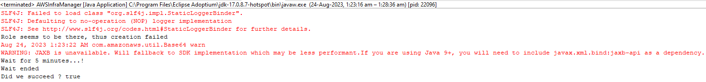

# Execution steps
1. Clone the repo at <a href="https://github.com/kalikirisrikarreddy/amazon-s3-events/edit/main/README.md">https://github.com/kalikirisrikarreddy/amazon-s3-events</a> to your local machine.
2. Import the project into IDE of your choice.
3. Run mvn package to build the shaded jar.
4. Edit the INPUT_BUCKET_NAME at amazon.s3.events.Constants.java to a unique name of your choice, it shouldn't conflict with other active S3 buckets in AWS.
5. amazon.s3.events.ImageBlur.java has the handler code, which essentially is the Lambda we want to run whenever an object is uploaded to S3, to blur the uploaded image and store the blurred image in the bucket with name OUTPUT_BUCKET_NAME at amazon.s3.events.Constants.java.
6. Edit line 39 and 41 at amazon.s3.events.AWSInfraManager.java to put your own AWS credentials.
7. Run amazon.s3.events.AWSInfraManager.java, as it has all the necessary code to setup the infrastructure and push a sample image to input bucket, needed to demonstrate how S3 events can be used to build asynchronous workflows. You should see output like this. 
